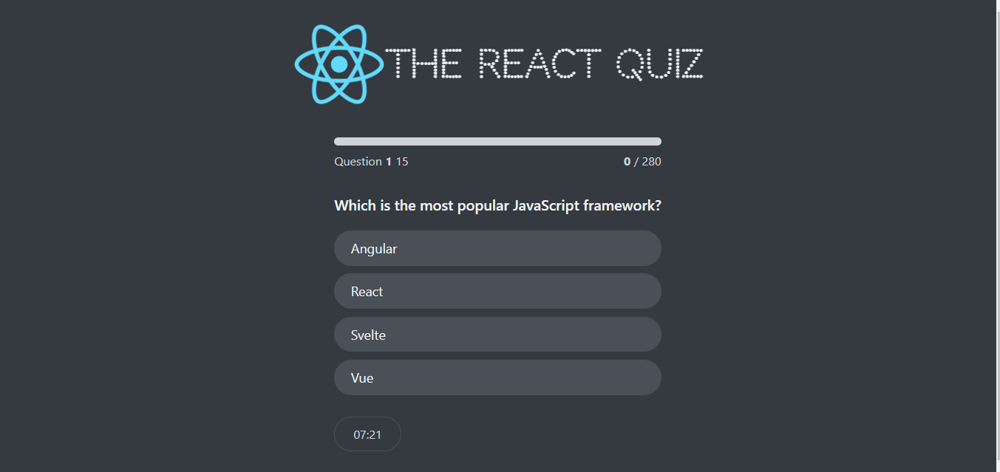

# React Quiz App


This is a dynamic and interactive quiz app built with React, leveraging the useReducer hook for efficient state management. The app offers a user-friendly interface for taking quizzes on various topics and is designed to be responsive and provide smooth user interactions. It features 15 questions per quiz and displays the answers for user review. 


## Demo 




## Functionality 
-  Users can choose from a variety of quiz topics.
Dynamic Question Handling: Each quiz dynamically loads questions and answers.
- Utilizes the useReducer hook for managing quiz state, including current question, selected answers, and score, ensuring a more organized and scalable state management solution.
- Users receive immediate feedback on their answers.
-  The app calculates and displays the user's score at the end of the quiz.
-  Compatible with various screen sizes for accessibility on desktop and mobile devices.
-  Users can see their progress throughout the quiz.
-  Users can restart the quiz at any time.


## Built With
- HTML 
- CSS - For styling 
- Flex
- Grid CSS
- React - JavaScript library (useReducer for managing state)
- Vite -  development build tool


## Usage
Install dependencies
```bash
npm install 
``````
Run React dev server
```bash
npm start
``````
Build for production
```bash
npm run build
```

## Acknowledgments
This project was created as part React course [Jonas Schmedtmann ](https://www.udemy.com/course/the-ultimate-react-course/)

## License

This project is open source and available under [the MIT License](https://opensource.org/licenses/MIT)
